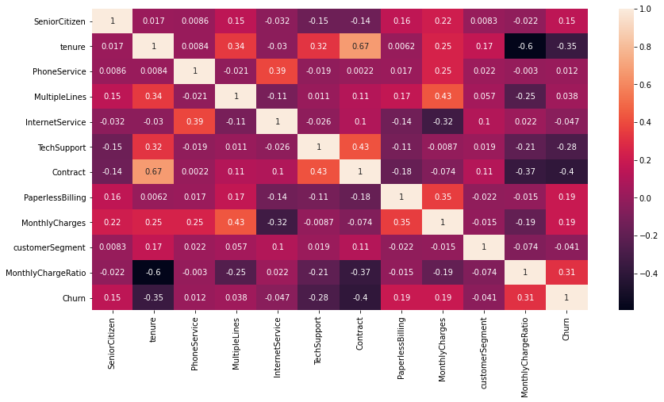

```python
import pandas as pd
import seaborn as sns
import warnings
warnings.filterwarnings("ignore")

import matplotlib.pyplot as plt
%matplotlib inline
plt.rcParams["figure.figsize"] = (14,7)
```

# 1- Feauture Engineering

### We will begin by importing the data into a pandas data frame and examining the data


```python
df = pd.read_csv("Telecom-Usage-Details.csv")
df.columns
```


    Index(['customerID', 'gender', 'SeniorCitizen', 'Partner', 'Dependents',
           'tenure', 'PhoneService', 'MultipleLines', 'InternetService',
           'OnlineSecurity', 'OnlineBackup', 'DeviceProtection', 'TechSupport',
           'StreamingTV', 'StreamingMovies', 'Contract', 'PaperlessBilling',
           'PaymentMethod', 'MonthlyCharges', 'TotalCharges', 'Churn'],
          dtype='object')


```python
df.info()
```

    <class 'pandas.core.frame.DataFrame'>
    RangeIndex: 7043 entries, 0 to 7042
    Data columns (total 21 columns):
     #   Column            Non-Null Count  Dtype  
    ---  ------            --------------  -----  
     0   customerID        7043 non-null   object 
     1   gender            7043 non-null   object 
     2   SeniorCitizen     7043 non-null   int64  
     3   Partner           7043 non-null   object 
     4   Dependents        7043 non-null   object 
     5   tenure            7043 non-null   int64  
     6   PhoneService      7043 non-null   object 
     7   MultipleLines     7043 non-null   object 
     8   InternetService   7043 non-null   object 
     9   OnlineSecurity    7043 non-null   object 
     10  OnlineBackup      7043 non-null   object 
     11  DeviceProtection  7043 non-null   object 
     12  TechSupport       7043 non-null   object 
     13  StreamingTV       7043 non-null   object 
     14  StreamingMovies   7043 non-null   object 
     15  Contract          7043 non-null   object 
     16  PaperlessBilling  7043 non-null   object 
     17  PaymentMethod     7043 non-null   object 
     18  MonthlyCharges    7043 non-null   float64
     19  TotalCharges      7043 non-null   object 
     20  Churn             7043 non-null   object 
    dtypes: float64(1), int64(2), object(18)
    memory usage: 1.1+ MB


### We notice somethings here:
1. SeniorCitizen Column has the Dtype of int64 although it's a categorical variable
2. TotalCharges values are not numerical

We will start analyzing the data and fixing these issues.

In the TotalCharges some records are " ", we will replace them with 0 and change the column to numeric values.

In the SeniorCitizen column we will replace 1 values with "yes" and 0 values with "no".


```python
replace_empty_with_0 = lambda x: "0" if x[0] ==" " else x
df.TotalCharges = df.TotalCharges.apply(replace_empty_with_0)
df.TotalCharges = pd.to_numeric(df.TotalCharges)

encode_SeniorCitizen = lambda x: "yes" if x ==1 else "no"
df.SeniorCitizen = df.SeniorCitizen.apply(encode_SeniorCitizen)
```


```python
df.describe()
```


<div>
<style scoped>
    .dataframe tbody tr th:only-of-type {
        vertical-align: middle;
    }

    .dataframe tbody tr th {
        vertical-align: top;
    }

    .dataframe thead th {
        text-align: right;
    }
</style>
<table border="1" class="dataframe">
  <thead>
    <tr style="text-align: right;">
      <th></th>
      <th>tenure</th>
      <th>MonthlyCharges</th>
      <th>TotalCharges</th>
    </tr>
  </thead>
  <tbody>
    <tr>
      <th>count</th>
      <td>7043.000000</td>
      <td>7043.000000</td>
      <td>7043.000000</td>
    </tr>
    <tr>
      <th>mean</th>
      <td>32.371149</td>
      <td>64.761692</td>
      <td>2279.734304</td>
    </tr>
    <tr>
      <th>std</th>
      <td>24.559481</td>
      <td>30.090047</td>
      <td>2266.794470</td>
    </tr>
    <tr>
      <th>min</th>
      <td>0.000000</td>
      <td>18.250000</td>
      <td>0.000000</td>
    </tr>
    <tr>
      <th>25%</th>
      <td>9.000000</td>
      <td>35.500000</td>
      <td>398.550000</td>
    </tr>
    <tr>
      <th>50%</th>
      <td>29.000000</td>
      <td>70.350000</td>
      <td>1394.550000</td>
    </tr>
    <tr>
      <th>75%</th>
      <td>55.000000</td>
      <td>89.850000</td>
      <td>3786.600000</td>
    </tr>
    <tr>
      <th>max</th>
      <td>72.000000</td>
      <td>118.750000</td>
      <td>8684.800000</td>
    </tr>
  </tbody>
</table>
</div>


#### Now all the features are the correct type, we will then make sure that we don't have any duplicate customerID or any duplicate values


```python
df = df.dropna()
len(df.customerID.value_counts())
```


    7043


## First added feature, total number of add on services


```python
df_services = df.iloc[:,6:14]
df_services
```


<div>
<style scoped>
    .dataframe tbody tr th:only-of-type {
        vertical-align: middle;
    }

    .dataframe tbody tr th {
        vertical-align: top;
    }

    .dataframe thead th {
        text-align: right;
    }
</style>
<table border="1" class="dataframe">
  <thead>
    <tr style="text-align: right;">
      <th></th>
      <th>PhoneService</th>
      <th>MultipleLines</th>
      <th>InternetService</th>
      <th>OnlineSecurity</th>
      <th>OnlineBackup</th>
      <th>DeviceProtection</th>
      <th>TechSupport</th>
      <th>StreamingTV</th>
    </tr>
  </thead>
  <tbody>
    <tr>
      <th>0</th>
      <td>No</td>
      <td>No phone service</td>
      <td>DSL</td>
      <td>No</td>
      <td>Yes</td>
      <td>No</td>
      <td>No</td>
      <td>No</td>
    </tr>
    <tr>
      <th>1</th>
      <td>Yes</td>
      <td>No</td>
      <td>DSL</td>
      <td>Yes</td>
      <td>No</td>
      <td>Yes</td>
      <td>No</td>
      <td>No</td>
    </tr>
    <tr>
      <th>2</th>
      <td>Yes</td>
      <td>No</td>
      <td>DSL</td>
      <td>Yes</td>
      <td>Yes</td>
      <td>No</td>
      <td>No</td>
      <td>No</td>
    </tr>
    <tr>
      <th>3</th>
      <td>No</td>
      <td>No phone service</td>
      <td>DSL</td>
      <td>Yes</td>
      <td>No</td>
      <td>Yes</td>
      <td>Yes</td>
      <td>No</td>
    </tr>
    <tr>
      <th>4</th>
      <td>Yes</td>
      <td>No</td>
      <td>Fiber optic</td>
      <td>No</td>
      <td>No</td>
      <td>No</td>
      <td>No</td>
      <td>No</td>
    </tr>
    <tr>
      <th>...</th>
      <td>...</td>
      <td>...</td>
      <td>...</td>
      <td>...</td>
      <td>...</td>
      <td>...</td>
      <td>...</td>
      <td>...</td>
    </tr>
    <tr>
      <th>7038</th>
      <td>Yes</td>
      <td>Yes</td>
      <td>DSL</td>
      <td>Yes</td>
      <td>No</td>
      <td>Yes</td>
      <td>Yes</td>
      <td>Yes</td>
    </tr>
    <tr>
      <th>7039</th>
      <td>Yes</td>
      <td>Yes</td>
      <td>Fiber optic</td>
      <td>No</td>
      <td>Yes</td>
      <td>Yes</td>
      <td>No</td>
      <td>Yes</td>
    </tr>
    <tr>
      <th>7040</th>
      <td>No</td>
      <td>No phone service</td>
      <td>DSL</td>
      <td>Yes</td>
      <td>No</td>
      <td>No</td>
      <td>No</td>
      <td>No</td>
    </tr>
    <tr>
      <th>7041</th>
      <td>Yes</td>
      <td>Yes</td>
      <td>Fiber optic</td>
      <td>No</td>
      <td>No</td>
      <td>No</td>
      <td>No</td>
      <td>No</td>
    </tr>
    <tr>
      <th>7042</th>
      <td>Yes</td>
      <td>No</td>
      <td>Fiber optic</td>
      <td>Yes</td>
      <td>No</td>
      <td>Yes</td>
      <td>Yes</td>
      <td>Yes</td>
    </tr>
  </tbody>
</table>
<p>7043 rows × 8 columns</p>
</div>


### Suppose we call 'OnlineSecurity', 'OnlineBackup', 'DeviceProtection', 'TechSupport','StreamingTV', 'StreamingMovies' Add on internet services
We will calculate the number of add-on services each customer has and study the relationship between that and the churn


```python
df_addon = df[['OnlineSecurity', 'OnlineBackup', 'DeviceProtection', 'TechSupport','StreamingTV', 'StreamingMovies']]
service_counter = lambda x: 1 if x =="Yes" else 0

df_addon = df_addon.applymap(service_counter)
```


```python
import numpy as np
n_of_addon_services = np.sum(np.asarray(df_addon),axis=1)
df["n_of_addon_services"] = n_of_addon_services
```


```python
sns.countplot(x="n_of_addon_services", hue="Churn", data=df)
```


    <matplotlib.axes._subplots.AxesSubplot at 0x7fb8ea281510>


### we see that the more services our custoner has, the less likely they are to leave. However we can represent this plot in a different way. We will plot the *percentage* rather than the *number* of churn in users with the same number of addon services on the y-axis so we can see the relationship more clearly


```python
df_n_of_services = df.groupby(['n_of_addon_services','Churn']).agg({'customerID': 'count'})
calc_pct = lambda x: round(100 * x / float(x.sum()),2)
Churn_percentages =df_n_of_services.groupby(level=0).apply(calc_pct)
Churn_percentages
```


<div>
<style scoped>
    .dataframe tbody tr th:only-of-type {
        vertical-align: middle;
    }

    .dataframe tbody tr th {
        vertical-align: top;
    }

    .dataframe thead th {
        text-align: right;
    }
</style>
<table border="1" class="dataframe">
  <thead>
    <tr style="text-align: right;">
      <th></th>
      <th></th>
      <th>customerID</th>
    </tr>
    <tr>
      <th>n_of_addon_services</th>
      <th>Churn</th>
      <th></th>
    </tr>
  </thead>
  <tbody>
    <tr>
      <th rowspan="2" valign="top">0</th>
      <th>No</th>
      <td>78.59</td>
    </tr>
    <tr>
      <th>Yes</th>
      <td>21.41</td>
    </tr>
    <tr>
      <th rowspan="2" valign="top">1</th>
      <th>No</th>
      <td>54.24</td>
    </tr>
    <tr>
      <th>Yes</th>
      <td>45.76</td>
    </tr>
    <tr>
      <th rowspan="2" valign="top">2</th>
      <th>No</th>
      <td>64.18</td>
    </tr>
    <tr>
      <th>Yes</th>
      <td>35.82</td>
    </tr>
    <tr>
      <th rowspan="2" valign="top">3</th>
      <th>No</th>
      <td>72.63</td>
    </tr>
    <tr>
      <th>Yes</th>
      <td>27.37</td>
    </tr>
    <tr>
      <th rowspan="2" valign="top">4</th>
      <th>No</th>
      <td>77.70</td>
    </tr>
    <tr>
      <th>Yes</th>
      <td>22.30</td>
    </tr>
    <tr>
      <th rowspan="2" valign="top">5</th>
      <th>No</th>
      <td>87.57</td>
    </tr>
    <tr>
      <th>Yes</th>
      <td>12.43</td>
    </tr>
    <tr>
      <th rowspan="2" valign="top">6</th>
      <th>No</th>
      <td>94.72</td>
    </tr>
    <tr>
      <th>Yes</th>
      <td>5.28</td>
    </tr>
  </tbody>
</table>
</div>


```python
Churn_percentages = Churn_percentages.reset_index()
Churn_percentages.columns = ['No. of add-on Services', 'Churn', 'Percentage of Churn']
sns.barplot(x = 'No. of add-on Services', y = 'Percentage of Churn', hue = 'Churn', data = Churn_percentages)
```


    <matplotlib.axes._subplots.AxesSubplot at 0x7fb8e65a9d90>


From this graph we can tell that the more services a customer has, the less likely to churn. Except for customers who have 0 add-on services (phone-only customers).

## Second Feature, Customer Segmentation based on customer's Tenure and TotalCharges


```python
from sklearn.cluster import KMeans
from sklearn.preprocessing import StandardScaler

X = df[["tenure", "TotalCharges"]]
y = df["customerID"]

scaler = StandardScaler()
X_scaled = scaler.fit_transform(X)
```

We begin by scaling Customer tenurity on the x-axis and customer total charges on the y-axis so our clustering could run more efficiently

### In my opinion 6 clusters is the most logical option
The six clusters provide a good indication of customer's tenurity vs. their value we will begin applying labels to these clusters and we will analyze more


```python
model_6 = KMeans(n_clusters=6, init="k-means++")
y = model_6.fit_predict(X_scaled)
sns.scatterplot(x = "tenure", y="TotalCharges", hue=y, data=df,legend="full", palette="muted")
```


    <matplotlib.axes._subplots.AxesSubplot at 0x7fb8e59c4d10>


```python
my_dict = {
    0:"high Ten/low Val",
    1:"int Ten/low-int Val",
    2:"high Ten/High Val",
    3:"int Ten/int Val",
    4:"high Ten/high-int Val",
    5:"low Ten/low Val"
}

customerSegment = []
for i in y:
    customerSegment.append(my_dict[int(i)])

df["customerSegment"] = customerSegment
```


```python
sns.scatterplot(x = "tenure", y="TotalCharges", hue="customerSegment", data=df,legend="full", palette="muted")
```


    <matplotlib.axes._subplots.AxesSubplot at 0x7fb8b9c9fbd0>


```python
sns.scatterplot(x = "tenure", y="TotalCharges", hue="customerSegment", data=df[df.Churn == "Yes"],legend="full", palette="muted")
```


    <matplotlib.axes._subplots.AxesSubplot at 0x7fb8b9bd4dd0>


## This plot shows customers who churned and their segment
### We can see that some customer segments are more likely to churn than others


```python
df_segmented = df.groupby(['customerSegment','Churn']).agg({'customerID': 'count'})
df_segmented
```


<div>
<style scoped>
    .dataframe tbody tr th:only-of-type {
        vertical-align: middle;
    }

    .dataframe tbody tr th {
        vertical-align: top;
    }

    .dataframe thead th {
        text-align: right;
    }
</style>
<table border="1" class="dataframe">
  <thead>
    <tr style="text-align: right;">
      <th></th>
      <th></th>
      <th>customerID</th>
    </tr>
    <tr>
      <th>customerSegment</th>
      <th>Churn</th>
      <th></th>
    </tr>
  </thead>
  <tbody>
    <tr>
      <th rowspan="2" valign="top">high Ten/High Val</th>
      <th>No</th>
      <td>744</td>
    </tr>
    <tr>
      <th>Yes</th>
      <td>92</td>
    </tr>
    <tr>
      <th rowspan="2" valign="top">high Ten/high-int Val</th>
      <th>No</th>
      <td>813</td>
    </tr>
    <tr>
      <th>Yes</th>
      <td>144</td>
    </tr>
    <tr>
      <th rowspan="2" valign="top">high Ten/low Val</th>
      <th>No</th>
      <td>646</td>
    </tr>
    <tr>
      <th>Yes</th>
      <td>19</td>
    </tr>
    <tr>
      <th rowspan="2" valign="top">int Ten/int Val</th>
      <th>No</th>
      <td>627</td>
    </tr>
    <tr>
      <th>Yes</th>
      <td>226</td>
    </tr>
    <tr>
      <th rowspan="2" valign="top">int Ten/low-int Val</th>
      <th>No</th>
      <td>1058</td>
    </tr>
    <tr>
      <th>Yes</th>
      <td>337</td>
    </tr>
    <tr>
      <th rowspan="2" valign="top">low Ten/low Val</th>
      <th>No</th>
      <td>1286</td>
    </tr>
    <tr>
      <th>Yes</th>
      <td>1051</td>
    </tr>
  </tbody>
</table>
</div>


### We will calculate the percentage of churn customers in each segment


```python
calc_pct = lambda x: round(100 * x / float(x.sum()),2)
Churn_percentages =df_segmented.groupby(level=0).apply(calc_pct)
Churn_percentages
```


<div>
<style scoped>
    .dataframe tbody tr th:only-of-type {
        vertical-align: middle;
    }

    .dataframe tbody tr th {
        vertical-align: top;
    }

    .dataframe thead th {
        text-align: right;
    }
</style>
<table border="1" class="dataframe">
  <thead>
    <tr style="text-align: right;">
      <th></th>
      <th></th>
      <th>customerID</th>
    </tr>
    <tr>
      <th>customerSegment</th>
      <th>Churn</th>
      <th></th>
    </tr>
  </thead>
  <tbody>
    <tr>
      <th rowspan="2" valign="top">high Ten/High Val</th>
      <th>No</th>
      <td>89.00</td>
    </tr>
    <tr>
      <th>Yes</th>
      <td>11.00</td>
    </tr>
    <tr>
      <th rowspan="2" valign="top">high Ten/high-int Val</th>
      <th>No</th>
      <td>84.95</td>
    </tr>
    <tr>
      <th>Yes</th>
      <td>15.05</td>
    </tr>
    <tr>
      <th rowspan="2" valign="top">high Ten/low Val</th>
      <th>No</th>
      <td>97.14</td>
    </tr>
    <tr>
      <th>Yes</th>
      <td>2.86</td>
    </tr>
    <tr>
      <th rowspan="2" valign="top">int Ten/int Val</th>
      <th>No</th>
      <td>73.51</td>
    </tr>
    <tr>
      <th>Yes</th>
      <td>26.49</td>
    </tr>
    <tr>
      <th rowspan="2" valign="top">int Ten/low-int Val</th>
      <th>No</th>
      <td>75.84</td>
    </tr>
    <tr>
      <th>Yes</th>
      <td>24.16</td>
    </tr>
    <tr>
      <th rowspan="2" valign="top">low Ten/low Val</th>
      <th>No</th>
      <td>55.03</td>
    </tr>
    <tr>
      <th>Yes</th>
      <td>44.97</td>
    </tr>
  </tbody>
</table>
</div>


### We can say here that our most at risk customers are:
1. Low tenurity and low value customers (44.97% churn rate)
2. Intermediate Tenurity and Intermediate value customers (26.49% churn rate)
3. Intermediate tenurity and low-intermediate value customers (24.16% churn rate)

### Our safest customers are:
1. High tenurity and low value customers (2.86% churn rate)
2. High tenurity and High value customers (11.00% churn rate)
3. High tenurity and high-intermediate value customers (15.05% churn rate)

It follows business logic that customers with the least churn are high tenurity and low value customers (ex. a sensior citizen who has only one line and has been with the company for a long time) and that customers with the highest churn rates are low tenurity and low value customers (ex. tourists buying single lines or people buying burner phones).

it's positive that most of the churn rates are happening in intermediate to low value customers. it follows logic that customers who are deeply investing in our service are less likely to leave.

### We will sort the clusters by the percentage of churn so we can get a nice graph


```python
Churn_percentages = Churn_percentages.reset_index()
Churn_percentages = pd.concat([Churn_percentages[Churn_percentages['Churn'] == 'No'].sort_values('customerID'),Churn_percentages[Churn_percentages['Churn'] == 'Yes']])
```


```python
Churn_percentages
```


<div>
<style scoped>
    .dataframe tbody tr th:only-of-type {
        vertical-align: middle;
    }

    .dataframe tbody tr th {
        vertical-align: top;
    }

    .dataframe thead th {
        text-align: right;
    }
</style>
<table border="1" class="dataframe">
  <thead>
    <tr style="text-align: right;">
      <th></th>
      <th>customerSegment</th>
      <th>Churn</th>
      <th>customerID</th>
    </tr>
  </thead>
  <tbody>
    <tr>
      <th>10</th>
      <td>low Ten/low Val</td>
      <td>No</td>
      <td>55.03</td>
    </tr>
    <tr>
      <th>6</th>
      <td>int Ten/int Val</td>
      <td>No</td>
      <td>73.51</td>
    </tr>
    <tr>
      <th>8</th>
      <td>int Ten/low-int Val</td>
      <td>No</td>
      <td>75.84</td>
    </tr>
    <tr>
      <th>2</th>
      <td>high Ten/high-int Val</td>
      <td>No</td>
      <td>84.95</td>
    </tr>
    <tr>
      <th>0</th>
      <td>high Ten/High Val</td>
      <td>No</td>
      <td>89.00</td>
    </tr>
    <tr>
      <th>4</th>
      <td>high Ten/low Val</td>
      <td>No</td>
      <td>97.14</td>
    </tr>
    <tr>
      <th>1</th>
      <td>high Ten/High Val</td>
      <td>Yes</td>
      <td>11.00</td>
    </tr>
    <tr>
      <th>3</th>
      <td>high Ten/high-int Val</td>
      <td>Yes</td>
      <td>15.05</td>
    </tr>
    <tr>
      <th>5</th>
      <td>high Ten/low Val</td>
      <td>Yes</td>
      <td>2.86</td>
    </tr>
    <tr>
      <th>7</th>
      <td>int Ten/int Val</td>
      <td>Yes</td>
      <td>26.49</td>
    </tr>
    <tr>
      <th>9</th>
      <td>int Ten/low-int Val</td>
      <td>Yes</td>
      <td>24.16</td>
    </tr>
    <tr>
      <th>11</th>
      <td>low Ten/low Val</td>
      <td>Yes</td>
      <td>44.97</td>
    </tr>
  </tbody>
</table>
</div>


```python
Churn_percentages = Churn_percentages
Churn_percentages.columns = ['Customer Segment', 'Churn', 'Percentage of Churn']
sns.barplot(x = 'Customer Segment', y = 'Percentage of Churn', hue = 'Churn', data = Churn_percentages)
```


    <matplotlib.axes._subplots.AxesSubplot at 0x7fb8b9afc990>


From this graph we can say generally the more tenured the customer is, the less likely they are to churn

### Third Feature: the ratio of monthly charges to total charges


```python
charge_ratio_calculator = lambda row: round(row['MonthlyCharges']/(row['TotalCharges']+1e-2),2) if row['TotalCharges'] >1 else 1
df['MonthlyChargeRatio'] = df.apply(charge_ratio_calculator, axis=1)
sns.boxplot(x = 'Churn',y ='MonthlyChargeRatio', data = df)
```


    <matplotlib.axes._subplots.AxesSubplot at 0x7fb8dc632790>


We can see that the churn customers tend to have a higher ratio of monthly charge/total charge. this could be interpreted as a result of them being generally less tenured

## Feature Selection


```python
df.columns
```


    Index(['customerID', 'gender', 'SeniorCitizen', 'Partner', 'Dependents',
           'tenure', 'PhoneService', 'MultipleLines', 'InternetService',
           'OnlineSecurity', 'OnlineBackup', 'DeviceProtection', 'TechSupport',
           'StreamingTV', 'StreamingMovies', 'Contract', 'PaperlessBilling',
           'PaymentMethod', 'MonthlyCharges', 'TotalCharges', 'Churn',
           'n_of_addon_services', 'customerSegment', 'MonthlyChargeRatio'],
          dtype='object')


```python
encoded_df = df[['gender', 'SeniorCitizen', 'Partner', 'Dependents', 'PhoneService', 'MultipleLines', 'InternetService',
       'OnlineSecurity', 'OnlineBackup', 'DeviceProtection', 'TechSupport',
       'StreamingTV', 'StreamingMovies', 'Contract', 'PaperlessBilling',
       'PaymentMethod','n_of_addon_services', 'customerSegment']]
from sklearn.preprocessing import OrdinalEncoder
ordinal_encoder = OrdinalEncoder()
encoded_array = ordinal_encoder.fit_transform(encoded_df)

from itertools import count
j = count(start=0, step = 1)
for i in encoded_df.columns:
    encoded_df[i] = encoded_array[:,next(j)]
```

### We encoded all of our categorical Features
We give the categorical features numerical values so we can plug them in the model


```python
encoded_df
```


<div>
<style scoped>
    .dataframe tbody tr th:only-of-type {
        vertical-align: middle;
    }

    .dataframe tbody tr th {
        vertical-align: top;
    }

    .dataframe thead th {
        text-align: right;
    }
</style>
<table border="1" class="dataframe">
  <thead>
    <tr style="text-align: right;">
      <th></th>
      <th>gender</th>
      <th>SeniorCitizen</th>
      <th>Partner</th>
      <th>Dependents</th>
      <th>PhoneService</th>
      <th>MultipleLines</th>
      <th>InternetService</th>
      <th>OnlineSecurity</th>
      <th>OnlineBackup</th>
      <th>DeviceProtection</th>
      <th>TechSupport</th>
      <th>StreamingTV</th>
      <th>StreamingMovies</th>
      <th>Contract</th>
      <th>PaperlessBilling</th>
      <th>PaymentMethod</th>
      <th>n_of_addon_services</th>
      <th>customerSegment</th>
    </tr>
  </thead>
  <tbody>
    <tr>
      <th>0</th>
      <td>0.0</td>
      <td>0.0</td>
      <td>1.0</td>
      <td>0.0</td>
      <td>0.0</td>
      <td>1.0</td>
      <td>0.0</td>
      <td>0.0</td>
      <td>2.0</td>
      <td>0.0</td>
      <td>0.0</td>
      <td>0.0</td>
      <td>0.0</td>
      <td>0.0</td>
      <td>1.0</td>
      <td>2.0</td>
      <td>1.0</td>
      <td>2.0</td>
    </tr>
    <tr>
      <th>1</th>
      <td>1.0</td>
      <td>0.0</td>
      <td>0.0</td>
      <td>0.0</td>
      <td>1.0</td>
      <td>0.0</td>
      <td>0.0</td>
      <td>2.0</td>
      <td>0.0</td>
      <td>2.0</td>
      <td>0.0</td>
      <td>0.0</td>
      <td>0.0</td>
      <td>1.0</td>
      <td>0.0</td>
      <td>3.0</td>
      <td>2.0</td>
      <td>5.0</td>
    </tr>
    <tr>
      <th>2</th>
      <td>1.0</td>
      <td>0.0</td>
      <td>0.0</td>
      <td>0.0</td>
      <td>1.0</td>
      <td>0.0</td>
      <td>0.0</td>
      <td>2.0</td>
      <td>2.0</td>
      <td>0.0</td>
      <td>0.0</td>
      <td>0.0</td>
      <td>0.0</td>
      <td>0.0</td>
      <td>1.0</td>
      <td>3.0</td>
      <td>2.0</td>
      <td>2.0</td>
    </tr>
    <tr>
      <th>3</th>
      <td>1.0</td>
      <td>0.0</td>
      <td>0.0</td>
      <td>0.0</td>
      <td>0.0</td>
      <td>1.0</td>
      <td>0.0</td>
      <td>2.0</td>
      <td>0.0</td>
      <td>2.0</td>
      <td>2.0</td>
      <td>0.0</td>
      <td>0.0</td>
      <td>1.0</td>
      <td>0.0</td>
      <td>0.0</td>
      <td>3.0</td>
      <td>5.0</td>
    </tr>
    <tr>
      <th>4</th>
      <td>0.0</td>
      <td>0.0</td>
      <td>0.0</td>
      <td>0.0</td>
      <td>1.0</td>
      <td>0.0</td>
      <td>1.0</td>
      <td>0.0</td>
      <td>0.0</td>
      <td>0.0</td>
      <td>0.0</td>
      <td>0.0</td>
      <td>0.0</td>
      <td>0.0</td>
      <td>1.0</td>
      <td>2.0</td>
      <td>0.0</td>
      <td>2.0</td>
    </tr>
    <tr>
      <th>...</th>
      <td>...</td>
      <td>...</td>
      <td>...</td>
      <td>...</td>
      <td>...</td>
      <td>...</td>
      <td>...</td>
      <td>...</td>
      <td>...</td>
      <td>...</td>
      <td>...</td>
      <td>...</td>
      <td>...</td>
      <td>...</td>
      <td>...</td>
      <td>...</td>
      <td>...</td>
      <td>...</td>
    </tr>
    <tr>
      <th>7038</th>
      <td>1.0</td>
      <td>0.0</td>
      <td>1.0</td>
      <td>1.0</td>
      <td>1.0</td>
      <td>2.0</td>
      <td>0.0</td>
      <td>2.0</td>
      <td>0.0</td>
      <td>2.0</td>
      <td>2.0</td>
      <td>2.0</td>
      <td>2.0</td>
      <td>1.0</td>
      <td>1.0</td>
      <td>3.0</td>
      <td>5.0</td>
      <td>1.0</td>
    </tr>
    <tr>
      <th>7039</th>
      <td>0.0</td>
      <td>0.0</td>
      <td>1.0</td>
      <td>1.0</td>
      <td>1.0</td>
      <td>2.0</td>
      <td>1.0</td>
      <td>0.0</td>
      <td>2.0</td>
      <td>2.0</td>
      <td>0.0</td>
      <td>2.0</td>
      <td>2.0</td>
      <td>1.0</td>
      <td>1.0</td>
      <td>1.0</td>
      <td>4.0</td>
      <td>3.0</td>
    </tr>
    <tr>
      <th>7040</th>
      <td>0.0</td>
      <td>0.0</td>
      <td>1.0</td>
      <td>1.0</td>
      <td>0.0</td>
      <td>1.0</td>
      <td>0.0</td>
      <td>2.0</td>
      <td>0.0</td>
      <td>0.0</td>
      <td>0.0</td>
      <td>0.0</td>
      <td>0.0</td>
      <td>0.0</td>
      <td>1.0</td>
      <td>2.0</td>
      <td>1.0</td>
      <td>2.0</td>
    </tr>
    <tr>
      <th>7041</th>
      <td>1.0</td>
      <td>1.0</td>
      <td>1.0</td>
      <td>0.0</td>
      <td>1.0</td>
      <td>2.0</td>
      <td>1.0</td>
      <td>0.0</td>
      <td>0.0</td>
      <td>0.0</td>
      <td>0.0</td>
      <td>0.0</td>
      <td>0.0</td>
      <td>0.0</td>
      <td>1.0</td>
      <td>3.0</td>
      <td>0.0</td>
      <td>2.0</td>
    </tr>
    <tr>
      <th>7042</th>
      <td>1.0</td>
      <td>0.0</td>
      <td>0.0</td>
      <td>0.0</td>
      <td>1.0</td>
      <td>0.0</td>
      <td>1.0</td>
      <td>2.0</td>
      <td>0.0</td>
      <td>2.0</td>
      <td>2.0</td>
      <td>2.0</td>
      <td>2.0</td>
      <td>2.0</td>
      <td>1.0</td>
      <td>0.0</td>
      <td>5.0</td>
      <td>3.0</td>
    </tr>
  </tbody>
</table>
<p>7043 rows × 18 columns</p>
</div>


```python
scaler = StandardScaler()
scaled_numeric = scaler.fit_transform(df[["tenure", "MonthlyCharges", "TotalCharges", "MonthlyChargeRatio"]])
```

### We also scaled the numerical features
We will now make a new df called processed_df with all of these processed values


```python
processed_df = df.copy()
processed_df[['gender', 'SeniorCitizen', 'Partner', 'Dependents', 'PhoneService', 'MultipleLines', 'InternetService',
       'OnlineSecurity', 'OnlineBackup', 'DeviceProtection', 'TechSupport',
       'StreamingTV', 'StreamingMovies', 'Contract', 'PaperlessBilling',
       'PaymentMethod','n_of_addon_services', 'customerSegment']] = encoded_df.copy()
processed_df[["tenure", "MonthlyCharges", "TotalCharges", "MonthlyChargeRatio"]] = scaled_numeric.copy()
```

### We will then encode our target feature (Churn)


```python
from sklearn.preprocessing import LabelEncoder
labelizer = LabelEncoder()
processed_df["Churn"] = labelizer.fit_transform(df["Churn"])
```


    array(['No', 'Yes'], dtype=object)


## Making the train and test sets
Since the data is not equally distributed across the Churn and the customerSgement columns we have to respect that when we sample the data. We want our training and test sets to have the same distribution as the original dataset. for this purpose we will use stratified split.


```python
from sklearn.model_selection import StratifiedShuffleSplit
split = StratifiedShuffleSplit(n_splits=2, test_size=0.3, random_state=0)
for train_index, test_index in split.split(processed_df, processed_df["customerSegment"], processed_df["Churn"]):
    strat_train_set = processed_df.loc[train_index]
    strat_test_set = processed_df.loc[test_index]
```


```python
strat_train_set.columns
```


    Index(['customerID', 'gender', 'SeniorCitizen', 'Partner', 'Dependents',
           'tenure', 'PhoneService', 'MultipleLines', 'InternetService',
           'OnlineSecurity', 'OnlineBackup', 'DeviceProtection', 'TechSupport',
           'StreamingTV', 'StreamingMovies', 'Contract', 'PaperlessBilling',
           'PaymentMethod', 'MonthlyCharges', 'TotalCharges', 'Churn',
           'n_of_addon_services', 'customerSegment', 'MonthlyChargeRatio'],
          dtype='object')


```python
X_train = strat_train_set[['gender', 'SeniorCitizen', 'Partner', 'Dependents',
       'tenure', 'PhoneService', 'MultipleLines', 'InternetService',
       'OnlineSecurity', 'OnlineBackup', 'DeviceProtection', 'TechSupport',
       'StreamingTV', 'StreamingMovies', 'Contract', 'PaperlessBilling',
       'PaymentMethod', 'MonthlyCharges', 'TotalCharges',
       'n_of_addon_services', 'customerSegment', 'MonthlyChargeRatio']]
y_train = strat_train_set['Churn']

X_test = strat_test_set[['gender', 'SeniorCitizen', 'Partner', 'Dependents',
       'tenure', 'PhoneService', 'MultipleLines', 'InternetService',
       'OnlineSecurity', 'OnlineBackup', 'DeviceProtection', 'TechSupport',
       'StreamingTV', 'StreamingMovies', 'Contract', 'PaperlessBilling',
       'PaymentMethod', 'MonthlyCharges', 'TotalCharges',
       'n_of_addon_services', 'customerSegment', 'MonthlyChargeRatio']]
y_test = strat_test_set['Churn']
```

## Feature Selection
We will use statsmodels logistic regression model and only keep features that are statistically significant to the model


```python
import statsmodels.discrete.discrete_model as ds


model= ds.MNLogit(y_train,X_train)
result=model.fit()
result.summary()
```

    Optimization terminated successfully.
             Current function value: 0.412129
             Iterations 8


<table class="simpletable">
<caption>MNLogit Regression Results</caption>
<tr>
  <th>Dep. Variable:</th>         <td>Churn</td>      <th>  No. Observations:  </th>  <td>  4930</td> 
</tr>
<tr>
  <th>Model:</th>                <td>MNLogit</td>     <th>  Df Residuals:      </th>  <td>  4908</td> 
</tr>
<tr>
  <th>Method:</th>                 <td>MLE</td>       <th>  Df Model:          </th>  <td>    21</td> 
</tr>
<tr>
  <th>Date:</th>            <td>Sat, 18 Apr 2020</td> <th>  Pseudo R-squ.:     </th>  <td>0.2897</td> 
</tr>
<tr>
  <th>Time:</th>                <td>17:39:33</td>     <th>  Log-Likelihood:    </th> <td> -2031.8</td>
</tr>
<tr>
  <th>converged:</th>             <td>True</td>       <th>  LL-Null:           </th> <td> -2860.3</td>
</tr>
<tr>
  <th>Covariance Type:</th>     <td>nonrobust</td>    <th>  LLR p-value:       </th>  <td> 0.000</td> 
</tr>
</table>
<table class="simpletable">
<tr>
        <th>Churn=1</th>          <th>coef</th>     <th>std err</th>      <th>z</th>      <th>P>|z|</th>  <th>[0.025</th>    <th>0.975]</th>  
</tr>
<tr>
  <th>gender</th>              <td>   -0.1004</td> <td>    0.078</td> <td>   -1.289</td> <td> 0.197</td> <td>   -0.253</td> <td>    0.052</td>
</tr>
<tr>
  <th>SeniorCitizen</th>       <td>    0.1814</td> <td>    0.101</td> <td>    1.789</td> <td> 0.074</td> <td>   -0.017</td> <td>    0.380</td>
</tr>
<tr>
  <th>Partner</th>             <td>    0.0464</td> <td>    0.094</td> <td>    0.494</td> <td> 0.621</td> <td>   -0.137</td> <td>    0.230</td>
</tr>
<tr>
  <th>Dependents</th>          <td>   -0.1277</td> <td>    0.108</td> <td>   -1.178</td> <td> 0.239</td> <td>   -0.340</td> <td>    0.085</td>
</tr>
<tr>
  <th>tenure</th>              <td>   -0.6124</td> <td>    0.191</td> <td>   -3.206</td> <td> 0.001</td> <td>   -0.987</td> <td>   -0.238</td>
</tr>
<tr>
  <th>PhoneService</th>        <td>   -1.1952</td> <td>    0.134</td> <td>   -8.930</td> <td> 0.000</td> <td>   -1.458</td> <td>   -0.933</td>
</tr>
<tr>
  <th>MultipleLines</th>       <td>    0.1047</td> <td>    0.046</td> <td>    2.285</td> <td> 0.022</td> <td>    0.015</td> <td>    0.195</td>
</tr>
<tr>
  <th>InternetService</th>     <td>    0.2921</td> <td>    0.165</td> <td>    1.771</td> <td> 0.077</td> <td>   -0.031</td> <td>    0.615</td>
</tr>
<tr>
  <th>OnlineSecurity</th>      <td>   -0.2663</td> <td>    0.090</td> <td>   -2.948</td> <td> 0.003</td> <td>   -0.443</td> <td>   -0.089</td>
</tr>
<tr>
  <th>OnlineBackup</th>        <td>   -0.1071</td> <td>    0.090</td> <td>   -1.190</td> <td> 0.234</td> <td>   -0.283</td> <td>    0.069</td>
</tr>
<tr>
  <th>DeviceProtection</th>    <td>   -0.1266</td> <td>    0.089</td> <td>   -1.422</td> <td> 0.155</td> <td>   -0.301</td> <td>    0.048</td>
</tr>
<tr>
  <th>TechSupport</th>         <td>   -0.2107</td> <td>    0.089</td> <td>   -2.379</td> <td> 0.017</td> <td>   -0.384</td> <td>   -0.037</td>
</tr>
<tr>
  <th>StreamingTV</th>         <td>    0.0333</td> <td>    0.082</td> <td>    0.405</td> <td> 0.686</td> <td>   -0.128</td> <td>    0.195</td>
</tr>
<tr>
  <th>StreamingMovies</th>     <td>    0.0216</td> <td>    0.083</td> <td>    0.260</td> <td> 0.795</td> <td>   -0.141</td> <td>    0.184</td>
</tr>
<tr>
  <th>Contract</th>            <td>   -0.7292</td> <td>    0.090</td> <td>   -8.060</td> <td> 0.000</td> <td>   -0.907</td> <td>   -0.552</td>
</tr>
<tr>
  <th>PaperlessBilling</th>    <td>    0.2910</td> <td>    0.090</td> <td>    3.246</td> <td> 0.001</td> <td>    0.115</td> <td>    0.467</td>
</tr>
<tr>
  <th>PaymentMethod</th>       <td>    0.0276</td> <td>    0.042</td> <td>    0.651</td> <td> 0.515</td> <td>   -0.055</td> <td>    0.111</td>
</tr>
<tr>
  <th>MonthlyCharges</th>      <td>    0.9605</td> <td>    0.155</td> <td>    6.194</td> <td> 0.000</td> <td>    0.657</td> <td>    1.264</td>
</tr>
<tr>
  <th>TotalCharges</th>        <td>    0.0468</td> <td>    0.191</td> <td>    0.245</td> <td> 0.806</td> <td>   -0.327</td> <td>    0.420</td>
</tr>
<tr>
  <th>n_of_addon_services</th> <td>   -0.0201</td> <td>    0.166</td> <td>   -0.121</td> <td> 0.904</td> <td>   -0.346</td> <td>    0.306</td>
</tr>
<tr>
  <th>customerSegment</th>     <td>   -0.0044</td> <td>    0.028</td> <td>   -0.159</td> <td> 0.874</td> <td>   -0.058</td> <td>    0.050</td>
</tr>
<tr>
  <th>MonthlyChargeRatio</th>  <td>    0.3898</td> <td>    0.049</td> <td>    7.960</td> <td> 0.000</td> <td>    0.294</td> <td>    0.486</td>
</tr>
</table>


```python
def exclude_irrelevant_features(X,y):
    columns = list(X.columns)
    while len(columns) > 0:
        model= ds.MNLogit(y,X[columns])
        result=model.fit(disp=0)
        largest_pval = result.pvalues.nlargest(1,0)
        if float(largest_pval.iloc[0])> .05:
            col_name = largest_pval.index[0]
            columns.remove(col_name)
        else:
            break
    return columns

good_columns = exclude_irrelevant_features(X_train,y_train)
```


```python
good_columns
```


    ['SeniorCitizen',
     'tenure',
     'PhoneService',
     'MultipleLines',
     'InternetService',
     'OnlineSecurity',
     'OnlineBackup',
     'DeviceProtection',
     'TechSupport',
     'Contract',
     'PaperlessBilling',
     'MonthlyCharges',
     'MonthlyChargeRatio']


### This function will run the logistic regression model iteratively and each run it will exclude the feature with the highest p value from the list of features. Once all features have p value less than 5% the function will return a list of the remaining features
However, we will try to remove features that strongly correlate to one another so naive bayes can perform better


```python
good_columns =['SeniorCitizen',
 'tenure',
 'PhoneService',
 'MultipleLines',
 'InternetService',
 'TechSupport',
 'Contract',
 'PaperlessBilling',
 'MonthlyCharges',
 'customerSegment',
 'MonthlyChargeRatio']
```


```python
df_corr = processed_df[good_columns + ['Churn']]
corrMatrix = df_corr.corr()
sns.heatmap(corrMatrix, annot=True)
```


    <matplotlib.axes._subplots.AxesSubplot at 0x7fb8dc3219d0>





There's still some degree dependence between some of these features, for example monthly charge ratio and tenure, and number of addon services and internet service. these are mutually dependent variables. However, I experimented with and without them and the both models perform better with this set of features despite the dependence.


```python
model= ds.MNLogit(y_train,X_train[good_columns])
result=model.fit()
result.summary()
```

    Optimization terminated successfully.
             Current function value: 0.417752
             Iterations 7


<table class="simpletable">
<caption>MNLogit Regression Results</caption>
<tr>
  <th>Dep. Variable:</th>         <td>Churn</td>      <th>  No. Observations:  </th>  <td>  4930</td> 
</tr>
<tr>
  <th>Model:</th>                <td>MNLogit</td>     <th>  Df Residuals:      </th>  <td>  4919</td> 
</tr>
<tr>
  <th>Method:</th>                 <td>MLE</td>       <th>  Df Model:          </th>  <td>    10</td> 
</tr>
<tr>
  <th>Date:</th>            <td>Sat, 18 Apr 2020</td> <th>  Pseudo R-squ.:     </th>  <td>0.2800</td> 
</tr>
<tr>
  <th>Time:</th>                <td>17:39:33</td>     <th>  Log-Likelihood:    </th> <td> -2059.5</td>
</tr>
<tr>
  <th>converged:</th>             <td>True</td>       <th>  LL-Null:           </th> <td> -2860.3</td>
</tr>
<tr>
  <th>Covariance Type:</th>     <td>nonrobust</td>    <th>  LLR p-value:       </th>  <td> 0.000</td> 
</tr>
</table>
<table class="simpletable">
<tr>
        <th>Churn=1</th>         <th>coef</th>     <th>std err</th>      <th>z</th>      <th>P>|z|</th>  <th>[0.025</th>    <th>0.975]</th>  
</tr>
<tr>
  <th>SeniorCitizen</th>      <td>    0.2229</td> <td>    0.097</td> <td>    2.292</td> <td> 0.022</td> <td>    0.032</td> <td>    0.414</td>
</tr>
<tr>
  <th>tenure</th>             <td>   -0.6441</td> <td>    0.068</td> <td>   -9.526</td> <td> 0.000</td> <td>   -0.777</td> <td>   -0.512</td>
</tr>
<tr>
  <th>PhoneService</th>       <td>   -1.4215</td> <td>    0.119</td> <td>  -11.968</td> <td> 0.000</td> <td>   -1.654</td> <td>   -1.189</td>
</tr>
<tr>
  <th>MultipleLines</th>      <td>    0.0826</td> <td>    0.044</td> <td>    1.863</td> <td> 0.062</td> <td>   -0.004</td> <td>    0.169</td>
</tr>
<tr>
  <th>InternetService</th>    <td>    0.2824</td> <td>    0.073</td> <td>    3.844</td> <td> 0.000</td> <td>    0.138</td> <td>    0.426</td>
</tr>
<tr>
  <th>TechSupport</th>        <td>   -0.2762</td> <td>    0.049</td> <td>   -5.680</td> <td> 0.000</td> <td>   -0.372</td> <td>   -0.181</td>
</tr>
<tr>
  <th>Contract</th>           <td>   -0.8739</td> <td>    0.086</td> <td>  -10.171</td> <td> 0.000</td> <td>   -1.042</td> <td>   -0.705</td>
</tr>
<tr>
  <th>PaperlessBilling</th>   <td>    0.2696</td> <td>    0.081</td> <td>    3.316</td> <td> 0.001</td> <td>    0.110</td> <td>    0.429</td>
</tr>
<tr>
  <th>MonthlyCharges</th>     <td>    1.0369</td> <td>    0.058</td> <td>   17.785</td> <td> 0.000</td> <td>    0.923</td> <td>    1.151</td>
</tr>
<tr>
  <th>customerSegment</th>    <td>   -0.0220</td> <td>    0.026</td> <td>   -0.858</td> <td> 0.391</td> <td>   -0.072</td> <td>    0.028</td>
</tr>
<tr>
  <th>MonthlyChargeRatio</th> <td>    0.4110</td> <td>    0.044</td> <td>    9.333</td> <td> 0.000</td> <td>    0.325</td> <td>    0.497</td>
</tr>
</table>


### These columns are the columns with the relevant pval (<5%) so we will only train our models on them
### We also notice that the correlation coefficient of these features are significantly high

## Making the the models
### Model 1: Logistic Regression


```python
from sklearn.linear_model import LogisticRegression
from sklearn.metrics import accuracy_score, roc_curve, auc
from sklearn.model_selection import cross_val_score
model1 = LogisticRegression()
model1.fit(X_train[good_columns],y_train)
scores = cross_val_score(model1, X_test[good_columns], y_test, cv=5, scoring='f1_macro')
print(f"Accuracy: {round(scores.mean(),2)} (+/-{round(scores.std() * 2,2)}). Accuracy measured over 5 folds.")
```

    Accuracy: 0.73 (+/-0.05). Accuracy measured over 5 folds.


### Model 2: Naive Bayes


```python
from sklearn.naive_bayes import GaussianNB

model2 = GaussianNB()
model2.fit(X_train[good_columns],y_train)
scores = cross_val_score(model2, X_test[good_columns], y_test, cv=5, scoring='f1_macro')
print(f"Accuracy: {round(scores.mean(),2)} (+/-{round(scores.std() * 2,2)}). Accuracy measured over 5 folds.")
```

    Accuracy: 0.74 (+/-0.05). Accuracy measured over 5 folds.


# Comparing Naive Bayes and Logistic Regression


```python
fpr1, tpr1, thresholds1 = roc_curve(y_test, model1.predict_proba(X_test[good_columns])[:,1])
auc1 = auc(fpr1, tpr1)

fpr2, tpr2, thresholds2 = roc_curve(y_test, model2.predict_proba(X_test[good_columns])[:,1])
auc2 = auc(fpr2, tpr2)
```

## here we calculate the false positive rate and the true positive rate fore each of our models
FPR is the rate of predictions that were classified as positive (in our case yes for churn) while they are actually negative. TPR are predictions that were classified as positive and they are actually positive.

We passed a list of probabilities for our positive (yes) class to the roc_curve function. the function calculates the FPR and TPR by setting different decision thresholds from 0 to 1 and classifying the points based on the probabilities we passed (above the threshold is positive and below the threshold is negative).

the auc is the area under the curve for each model. higher values indicate a better model


```python
plt.figure()
lw = 2
plt.plot(fpr1, tpr1, color='darkorange',lw=lw, label='ROC curve for Logistic Regression (auc = %0.2f)' % auc1)
plt.plot(fpr2, tpr2, color='darkblue',lw=lw, label='ROC curve for Naive Bayes (auc = %0.2f)' % auc2)
plt.plot([0, 1], [0, 1], color='red', lw=lw, linestyle='--')
plt.xlim([0.0, 1.0])
plt.ylim([0.0, 1.05])
plt.xlabel('False Positive Rate')
plt.ylabel('True Positive Rate')
plt.title('Receiver operating characteristic')
plt.legend(loc="lower right")
```


    <matplotlib.legend.Legend at 0x7fb8dc2fd210>


### Ploting the confusion matrices


```python
import scikitplot as skplt
def confusion(y_test, y_predict):
    fig, ax = plt.subplots()

    skplt.metrics.plot_confusion_matrix(
        y_test, 
        y_predict,
        ax=ax)
    plt.show()
```


```python
y_pred1 = model1.predict(X_test[good_columns])
accuracy_score(y_test, y_pred1)
```


    0.8078561287269286


```python
y_pred2 = model2.predict(X_test[good_columns])
accuracy_score(y_test, y_pred2)
```


    0.7789872219592996


```python
print('Logistic Regression')
confusion(y_test, y_pred1)
```

    Logistic Regression


```python
print('Naive Bayes')
confusion(y_test, y_pred2)
```

    Naive Bayes


### We might be tempted to say that logistic regression performs better than naive bayes in this application. It has the better accuracy over 5 k-folds. it has the higher ROC curve AUC and it has better overall accuracy.

 ### However examining the confusion matrices reveals that Naive Bayes has a higher chance of predicting the positive class (Churn = yes) compared to logistic regression, while performing worse over the negative class. According to the business application, this information might affect which model we settle for.


```python
from sklearn.metrics import classification_report
print(classification_report(y_test, y_pred1, target_names=labelizer.classes_))
```

                  precision    recall  f1-score   support
    
              No       0.84      0.91      0.87      1560
             Yes       0.67      0.52      0.59       553
    
        accuracy                           0.81      2113
       macro avg       0.76      0.72      0.73      2113
    weighted avg       0.80      0.81      0.80      2113
    


```python
print(classification_report(y_test, y_pred2, target_names=labelizer.classes_))
```

                  precision    recall  f1-score   support
    
              No       0.89      0.80      0.84      1560
             Yes       0.56      0.73      0.63       553
    
        accuracy                           0.78      2113
       macro avg       0.73      0.76      0.74      2113
    weighted avg       0.80      0.78      0.79      2113
    


## As we can see the f1-score for the 'Yes' class is higher in the naive bayes classifier. Which suggests it might be more useful in this business use case.
